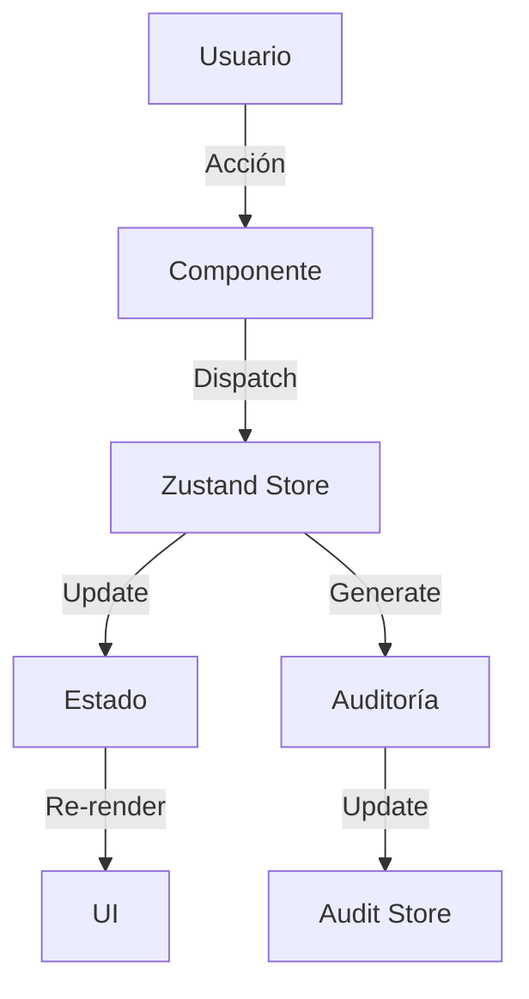
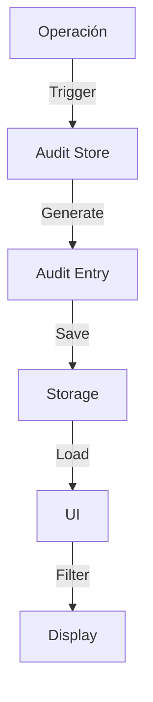

# Sistema de Gestión de Productos

Un sistema web moderno para la gestión de productos, construido con React y TypeScript, que permite realizar operaciones CRUD, auditoría de cambios y visualización de estadísticas.

## 📋 Índice
- [Características](#-características-principales)
- [Stack Tecnológico](#-stack-tecnológico)
- [Arquitectura](#-arquitectura)
- [Decisiones Técnicas](#-decisiones-técnicas)
- [Flujo de Datos](#-flujo-de-datos)
- [Sistema de Diseño](#-sistema-de-diseño)
- [Responsive Design](#-responsive-design)
- [Seguridad](#-seguridad)
- [Instalación](#-instalación)
- [Preguntas Frecuentes](#-preguntas-frecuentes)

## 🚀 Características Principales

### Gestión de Productos
- **CRUD Completo**
  - Creación con validación de campos
  - Lectura con búsqueda y filtrado
  - Actualización con historial de cambios
  - Eliminación con confirmación
- **Búsqueda Avanzada**
  - Búsqueda por nombre y descripción
  - Filtrado en tiempo real
  - Resultados paginados
- **Ordenamiento Múltiple**
  - Por código (ascendente/descendente)
  - Por nombre (A-Z/Z-A)
  - Por cantidad (mayor/menor)
  - Por fecha (más reciente/antigua)
- **Paginación Inteligente**
  - Navegación numérica
  - Límite configurable por página
  - Indicador de resultados totales

### Dashboard Principal
- **Estadísticas en Tiempo Real**
  - Total de productos
  - Producto más reciente
  - Producto más antiguo
  - Actualización automática
- **Auditoría de Cambios**
  - Registro detallado de operaciones
  - Filtrado por producto (actual y anterior)
  - Ordenamiento por nombre
  - Paginación de registros
- **Productos más Numerosos**
  - Agrupación por nombre
  - Suma de cantidades
  - Ordenamiento por cantidad
  - Visualización en cards

### Sistema de Auditoría
- **Registro Automático**
  - Timestamp preciso
  - Usuario (preparado para autenticación)
  - Tipo de operación
  - Detalles del cambio
- **Trazabilidad**
  - Historial completo de cambios
  - Registro detallado de modificaciones
    - Cambios de nombre con valor anterior y nuevo
    - Cambios de descripción con valor anterior y nuevo
    - Cambios de cantidad con valor anterior y nuevo
    - Registro múltiple para cambios de nombre
  - Filtrado por nombre actual y anterior del producto
  - Ordenamiento cronológico
- **Optimización de Carga**
  - Lazy loading de componentes
  - Dynamic imports
  - Suspense con fallback personalizado
  - Animaciones de carga fluidas

## 🛠️ Stack Tecnológico

### Frontend
- **React 18**
  - Hooks personalizados
  - Componentes funcionales
  - Lazy loading y Suspense
  - Optimización de rendimiento
- **TypeScript 5**
  - Tipado estricto
  - Interfaces bien definidas
  - Enums para constantes
  - Tipos genéricos
- **Zustand 4**
  - Estado global
  - Persistencia automática
  - Middleware personalizado
  - Slices para modularidad

### UI/UX
- **CSS-in-JS**
  - Estilos dinámicos
  - Temas personalizables
  - Variables CSS
  - Media queries
- **Iconify**
  - Iconos vectoriales
  - Personalización de tamaño
  - Personalización de color
  - Optimización de carga
- **Animaciones**
  - Transiciones suaves
  - Loading states
  - Feedback visual
  - Indicadores de progreso

## 🏗️ Arquitectura

### Estructura de Carpetas
```
src/
├── components/          # Componentes reutilizables
│   ├── Cards/          # Componentes de tarjetas
│   ├── Inputs/         # Componentes de entrada
│   ├── Layout/         # Componentes de estructura
│   ├── LoadingScreen/  # Componente de carga
│   └── Subtitles/      # Componentes de títulos
├── hooks/              # Hooks personalizados
│   └── useColors.ts    # Hook para gestión de colores
├── pages/              # Páginas principales
│   ├── AddProduct.tsx  # Añadir producto
│   ├── DeleteProduct.tsx # Eliminar producto
│   ├── HomeDashboard.tsx # Dashboard principal
│   ├── Products.tsx    # Lista de productos
│   └── UpdateProduct.tsx # Actualizar producto
├── stores/             # Estado global
│   ├── products.ts     # Store de productos
│   └── auditories.ts   # Store de auditoría
├── styles/             # Estilos globales
│   └── animations.css  # Animaciones globales
└── types/              # Definiciones de tipos
    └── index.ts        # Tipos globales
```

### Gestión de Estado
- **Zustand Store**
  ```typescript
  // products.ts
  interface ProductStore {
    products: Product[];
    addProduct: (product: Product) => void;
    removeProduct: (cod: number) => void;
    updateProduct: (cod: number, product: Partial<Product>) => void;
    clearProducts: () => void;
    getProduct: (cod: number) => Product | undefined;
  }

  // auditories.ts
  interface AuditoryStore {
    auditories: Auditory[];
    addAuditory: (auditory: Omit<Auditory, 'id' | 'timestamp'>) => void;
    clearAuditories: () => void;
    getAuditories: (page: number, limit: number) => {
      auditories: Auditory[];
      total: number;
    };
    getAuditoriesByProduct: (productName: string, page: number, limit: number) => {
      auditories: Auditory[];
      total: number;
    };
  }
  ```

### Componentes Principales
- **Layout**
  - Estructura base
  - Navegación
  - Contenedor principal
  - Responsive design
- **Cards**
  - ProductCard
  - AuditoryCard
  - StatsCard
  - ProductAmountCard
- **Inputs**
  - SelectInput
  - TextInput
  - NumberInput
- **LoadingScreen**
  - Animación de carga
  - Indicador de progreso
  - Feedback visual
  - Diseño responsivo
- **Pagination**
  - Navegación numérica
  - Botones prev/next
  - Indicador de página actual
  - Límite de páginas visibles

## 💡 Decisiones Técnicas

### 1. Gestión de Estado con Zustand
- **¿Por qué Zustand?**
  - API más simple que Redux
  - Menos boilerplate
  - Mejor rendimiento
  - Soporte nativo para TypeScript
  - Persistencia fácil

### 2. Optimización de Rendimiento
- **Lazy Loading**
  ```typescript
  // App.tsx
  const HomeDashboard = lazy(() => import("./pages/HomeDashboard"));
  const Products = lazy(() => import("./pages/Products"));
  ```
- **Suspense con Fallback**
  ```typescript
  <Suspense fallback={<LoadingScreen />}>
    <Routes>
      <Route path="/" element={<HomeDashboard />} />
      {/* ... más rutas ... */}
    </Routes>
  </Suspense>
  ```
- **Animaciones Optimizadas**
  ```css
  @keyframes spin {
    from { transform: rotate(0deg); }
    to { transform: rotate(360deg); }
  }
  ```

### 3. Sistema de Auditoría Mejorado
- **Registro Detallado**
  ```typescript
  // Ejemplo de mensaje de auditoría
  "El usuario actualizó el nombre de 'Producto A' a 'Producto B', 
   la descripción de 'Desc A' a 'Desc B' y 
   la cantidad de 5 a 10 del producto"
  ```
- **Doble Registro para Cambios de Nombre**
  - Mantiene historial completo
  - Permite filtrado por nombre anterior
  - Mejora la trazabilidad

### 4. Persistencia de Datos
- **LocalStorage**
  - Elección sobre IndexedDB
    - Simplicidad de implementación
    - Suficiente para el caso de uso
    - Mejor rendimiento para datos pequeños
  - Persistencia automática
    - Middleware de Zustand
    - Serialización automática
    - Manejo de errores
  - Límites y consideraciones
    - Tamaño máximo: 5-10MB
    - Solo strings
    - Síncrono

### 5. Diseño Responsivo
- **Enfoque Mobile-first**
  ```typescript
  const [isMobile, setIsMobile] = useState(window.innerWidth <= 768);

  useEffect(() => {
    const handleResize = () => {
      setIsMobile(window.innerWidth <= 768);
    };
    window.addEventListener('resize', handleResize);
    return () => window.removeEventListener('resize', handleResize);
  }, []);
  ```
- **Breakpoints**
  - Mobile: < 768px
  - Desktop: ≥ 768px
- **Adaptaciones**
  - Layout flexible
  - Grid system
  - Componentes responsivos
  - Navegación optimizada

### 6. Manejo de Fechas
- **Localización**
  ```typescript
  new Date().toLocaleString('es-ES', {
    day: '2-digit',
    month: '2-digit',
    year: 'numeric',
    hour: '2-digit',
    minute: '2-digit',
    hour12: true
  })
  ```
- **Características**
  - Formato español
  - Día/Mes/Año
  - Hora en formato 12h
  - Consistencia global

### 7. Sistema de Temas
- **¿Por qué un sistema de temas?**
  - Mejor experiencia de usuario
  - Accesibilidad mejorada
  - Reducción de fatiga visual
  - Personalización

- **Implementación**
  - Hook personalizado `useTheme`
  - Persistencia en localStorage
  - Respeto a preferencias del sistema
  - Transiciones suaves

- **Características**
  - Cambio instantáneo
  - Persistencia entre sesiones
  - Transiciones animadas
  - Consistencia global

## 🔄 Flujo de Datos

### 1. Operaciones CRUD


### 2. Auditoría


## 🎨 Sistema de Diseño

### Temas (Claro/Oscuro)
```typescript
// Definición de temas
const themes = {
  light: {
    primary: "#2563eb",
    primary_light: "#3b82f6",
    primary_content: "#ffffff",
    secondary: "#4b5563",
    secondary_light: "#6b7280",
    secondary_content: "#ffffff",
    background: "#ffffff",
    foreground: "#f3f4f6",
    copy: "#1f2937",
    copy_light: "#4b5563",
    copy_lighter: "#6b7280"
  },
  dark: {
    primary: "#3b82f6",
    primary_light: "#60a5fa",
    primary_content: "#ffffff",
    secondary: "#9ca3af",
    secondary_light: "#d1d5db",
    secondary_content: "#1f2937",
    background: "#1f2937",
    foreground: "#111827",
    copy: "#f3f4f6",
    copy_light: "#d1d5db",
    copy_lighter: "#9ca3af"
  }
};

// Hook personalizado para gestión de temas
const useTheme = () => {
  const [theme, setTheme] = useState<'light' | 'dark'>('light');

  useEffect(() => {
    // Cargar tema guardado o usar preferencia del sistema
    const savedTheme = localStorage.getItem('theme');
    const systemPrefersDark = window.matchMedia('(prefers-color-scheme: dark)').matches;
    
    setTheme(savedTheme || (systemPrefersDark ? 'dark' : 'light'));
  }, []);

  const toggleTheme = () => {
    const newTheme = theme === 'light' ? 'dark' : 'light';
    setTheme(newTheme);
    localStorage.setItem('theme', newTheme);
  };

  return { theme, toggleTheme, colors: themes[theme] };
};
```

### Implementación del Tema
- **Persistencia**
  - Guardado en localStorage
  - Respeto a preferencias del sistema
  - Transición suave entre temas

- **Variables CSS**
  ```css
  :root {
    /* Variables dinámicas basadas en el tema actual */
    --color-primary: var(--theme-primary);
    --color-background: var(--theme-background);
    --color-text: var(--theme-copy);
  }
  ```

- **Transiciones**
  ```css
  * {
    transition: background-color 0.3s ease, color 0.3s ease;
  }
  ```

### Colores
```typescript
interface Colors {
  primary: string;
  primary_light: string;
  primary_content: string;
  secondary: string;
  secondary_light: string;
  secondary_content: string;
  background: string;
  foreground: string;
  copy: string;
  copy_light: string;
  copy_lighter: string;
}
```

## 📱 Responsive Design

### Breakpoints
```typescript
const breakpoints = {
  mobile: '768px',
  tablet: '1024px',
  desktop: '1280px'
};
```

### Adaptaciones
```typescript
const styles = {
  container: {
    display: "flex",
    flexDirection: isMobile ? "column" : "row",
    gap: isMobile ? "8px" : "16px",
  }
};
```

## 🔒 Seguridad

### Validación de Datos
```typescript
const validateProduct = (product: Product): boolean => {
  if (!product.name.trim() || !product.description.trim()) {
    return false;
  }
  if (product.amount < 0) {
    return false;
  }
  return true;
};
```

### Sanitización
```typescript
const sanitizeInput = (input: string): string => {
  return input.trim().replace(/[<>]/g, '');
};
```

## 🛠️ Instalación

```bash
# Clonar repositorio
git clone [url-del-repositorio]

# Instalar dependencias
npm install

# Iniciar desarrollo
npm run dev

# Construir para producción
npm run build
```

## ❓ Preguntas Frecuentes

### 1. ¿Por qué Zustand en lugar de Redux?
- API más simple y directa
- Menos código boilerplate
- Mejor rendimiento
- Mejor integración con TypeScript
- Persistencia más sencilla

### 2. ¿Por qué LocalStorage en lugar de IndexedDB?
- Suficiente para el caso de uso
- Implementación más simple
- Mejor rendimiento para datos pequeños
- Persistencia automática con Zustand

### 3. ¿Cómo se maneja la auditoría?
- Registro automático de operaciones
- Timestamps precisos
- Formato localizado
- Trazabilidad completa
- Filtrado y ordenamiento

### 4. ¿Cómo se implementa el diseño responsivo?
- Enfoque mobile-first
- Breakpoints definidos
- Componentes flexibles
- Grid system adaptativo
- Media queries

### 5. ¿Cómo se manejan las fechas?
- Formato español
- Localización completa
- Consistencia global
- Timestamps precisos
- Formato 12h

### 6. ¿Cómo funciona el sistema de temas?
- Implementación con hook personalizado
- Persistencia en localStorage
- Respeto a preferencias del sistema
- Transiciones suaves
- Consistencia en toda la aplicación

## 📝 Licencia

Este proyecto está bajo la Licencia MIT.